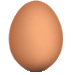
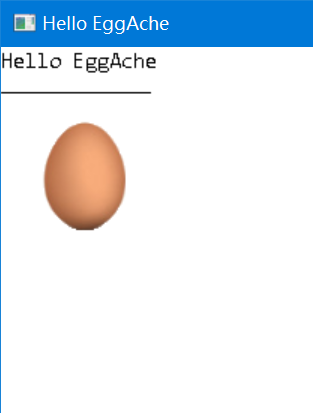
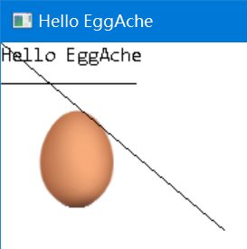
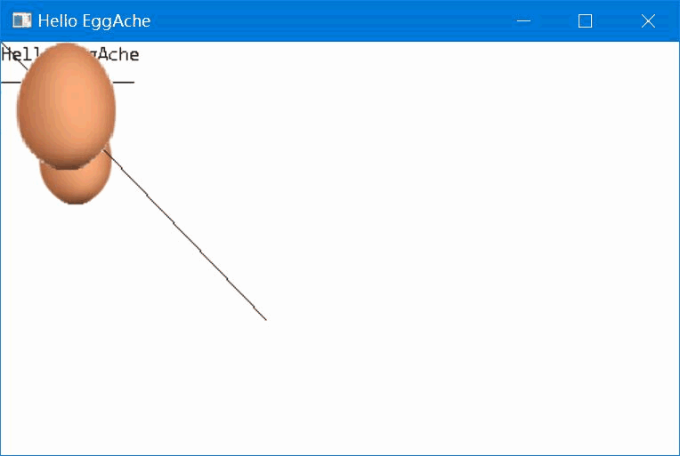

# EggAche-GL

EggAche is a **Lightweight**, **Cross-Platform** C++ Graphics Library

- You can easily embed the code **WHEREVER** there needs a GUI
- You can take **Snapshot** of the Window (if there should be a **Graphical Log**)

Welcome to Join :wink:



## Setup

### Microsoft Windows

Requirements:

- **MSVC** and **Windows SDK** (installed with *Visual Studio*)
- **g++** and **MinGW**

Steps:

1. Download this Project's **_[zip](https://github.com/BOT-Man-JL/EggAche-GL/archive/master.zip)_**
2. Add the `EggAche.h`, `EggAche.cpp`, `EggAche_Impl.h` and `Windows_Impl.cpp` in **_[src](https://github.com/BOT-Man-JL/EggAche-GL/tree/master/src)_ directory** to your project
3. `#include "EggAche.h"` where you want to use EggAche Library
4. Add `#define EGGACHE_WINDOWS` in `EggAche.h` to specify that you are on Windows

### UNIX / X Window System

Support **Linux**, **Mac OSX** and other **Unix/Unix-Like** Systems.

Still on the way :innocent:

## Get Started

### Basic Usage

- Create Window
- Draw on Background Egg
- Refresh Window
- Wait for User Closing the Window

``` c++
#include <thread>    // For this_thread::sleep_for
#include "EggAche.h"

int main ()
{
    using namespace EggAche;

    Window window;                          // Create a new Window
    auto bgEgg = window.GetBackground ();   // Get Background Egg of this Window

    bgEgg->DrawTxt (0, 0, "Hello EggAche"); // Draw Text at (0, 0)
    bgEgg->DrawLine (0, 30, 100, 30);       // Draw Line From (0, 30) to (100, 30)
    bgEgg->DrawImg ("Egg.bmp", 20, 50);     // Draw Bmp at (20, 50)

    window.Refresh ();                      // Refresh the Window to View Changes

    while (!window.IsClosed ())             // Not Quit until the Window is closed
    {
        using namespace std::chrono_literals;
        std::this_thread::sleep_for (500ms);
    }
    return 0;
}
```



### Handling Click Event

- Bind Event Handler to a Window
- Associate an Egg to another one
- Take a Snapshot of the Window

``` c++
    // ...
    //window.Refresh ();
    
    auto lineEgg = new Egg (1000, 750);    // Create a New Egg
    bgEgg->AddEgg (lineEgg);               // Associate this new Egg with Background Egg

    window.OnClick ([&]
    (Window *, int x, int y)               // Register OnClick Event
    {
        lineEgg->Clear ();                 // Clear Previous Content
        lineEgg->DrawLine (0, 0, x, y);    // Draw Line from (0, 0) to the Point you Clicked
        window.Refresh ();                 // Refresh the Window to View Changes

        bgEgg->SaveAsBmp ("Snapshot.bmp"); // Take a Snapshot :-)
    });

    //while (!window.IsClosed ())
    // ...
    delete lineEgg;                        // Remember to delete this Egg
    //return 0;
```



And you will notice that `Snapshot.bmp` has been saved :wink:

### Simple Animation

- Draw BMP File with a Color Mask
- Add Animation into the Game Loop

``` c++
    // ...
    //window.OnClick (...);

    auto aniEgg = new Egg (100, 100,        // Create a New Egg
                           100, 100);       // at (100, 100) initially
    bgEgg->AddEgg (aniEgg);                 // Associate this new Egg with Background Egg
    aniEgg->DrawImg ("Egg.bmp", 0, 0,       // Draw Bmp at (0, 0)
                     100, 100,              // of size 100 * 100
                     255, 255, 255);        // leave out White Color (FFFFFF)

    auto offset = 0;
    while (!window.IsClosed ())             // Rewrite this Part
    {
        if (offset < 10) offset++;          // Update offset
        else offset = -10;
        aniEgg->MoveTo (100 + offset * 10,  // Move aniEgg
                        100 + offset * 10);
        window.Refresh ();                  // Refresh Window

        using namespace std::chrono_literals;
        std::this_thread::sleep_for (50ms); // Sleep just 50ms
    }

    delete aniEgg;                          // Remember to delete this Egg
    //delete lineEgg;
    // ...
```



### Remarks

- As there's **_NO_** **built-in thread-safe** in EggAche, the reentrant behaviors of this Sample are unknown... :disappointed_relieved:
- [Click for more Samples](https://github.com/BOT-Man-JL/EggAche-GL/tree/master/Samples)

## Update History

- [v1.0](https://github.com/BOT-Man-JL/EggAche-GL/raw/master/EggAche_C.zip)
  - This version is written in **C**
  - There's **No Classes and Objects**
  - There's only **GDI Wrappers**...
- [v2.0](https://github.com/BOT-Man-JL/EggAche-GL/releases/tag/v2.0)
  - This version is written in **C++**
  - Everything is encapsulated in **Classes**
- [v3.0](https://github.com/BOT-Man-JL/EggAche-GL/archive/master.zip)
  - **Decoupling** Platform Dependency
  - Introducing **C++ 11 Features** (*concept, lambda, stl...*)
  - Using **Bridge Pattern** to Separate the Common Interface (`EggAche_Impl.h`) from Platform-specific Implementations (`*_Impl.h`)
  - Using **Template Method** to Implement the Common Behaviors (`EggAche.cpp`)
  - Using **Abstract Factory** to Produce Platform-specific Implementation Objects for diverse Platforms (`EggAche.cpp`)
  - Using **Composite Pattern** to Define the Layout of Canvases (`EggAche.h`)
  - Using **Adapter Pattern** to Convert the interface of `WindowImpl Events` into `Window Events` (`EggAche.cpp`)
  - Using **Observer Pattern** to Notify Window Events and Auto Redraw (`*_Impl.h`)
  - Using **Strategy Pattern** to Implement *Inversion of Control* in Window Event System and Saving Images (`EggAche.h`, `EggAche.cpp`, `*_Impl.cpp`)
  - Using **[RAII](https://en.wikipedia.org/wiki/Resource_acquisition_is_initialization) ~~Singleton Pattern~~** to Maintain the Global Resource Manager (`*_Impl.h`)