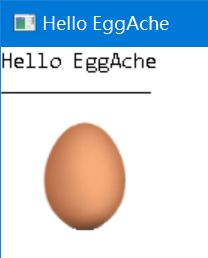

# EggAche-GL

EggAche is a **Lightweight**, **Cross-Platform** C++ Graphics Library

- You can easily embed the code **WHEREVER** there needs a GUI
- You can take **Snapshot** of the Window (if there should be a **Graphical Log**)

Welcome to Join :wink:


## Setup

### Microsoft Windows

Requirements:

- **MSVC** and **Windows SDK** (installed with *Visual Studio*)
- **g++** and **MinGW**

Steps:

1. Download this Project's **_[zip](https://github.com/BOT-Man-JL/EggAche-GL/archive/master.zip)_**
2. Add the `EggAche.h`, `EggAche.cpp`, `EggAche_Impl.h` and `Windows_Impl.cpp` in **_[src](https://github.com/BOT-Man-JL/EggAche-GL/tree/master/src)_ directory** to your project
3. `#include "EggAche.h"` where you want to use EggAche Library
4. Add `#define EGGACHE_WINDOWS` in `EggAche.h` to specify that you are on Windows

### UNIX / X Window System

Support **Linux**, **Mac OSX** and other **Unix/Unix-Like** Systems.

Still on the way :innocent:

## Get Started

### Basic Usage

- Create Window and Canvas
- Draw on Background Canvas
- Refresh Window
- Wait for User Closing the Window

``` c++
Window window (640, 480);               // Create a new Window
Canvas bgCanvas (640, 480);             // Create a new Canvas
window.SetBackground (&bgCanvas);       // Set Background Canvas of this Window

bgCanvas.DrawTxt (0, 0, "Hello EggAche");  // Draw Text at (0, 0)
bgCanvas.DrawLine (0, 30, 100, 30);        // Draw Line From (0, 30) to (100, 30)
bgCanvas.DrawImg ("Egg.bmp", 20, 50);      // Draw Canvas at (20, 50)

window.Refresh ();                      // Refresh the Window to View Changes

while (!window.IsClosed ())             // Not Quit until the Window is closed
    std::this_thread::sleep_for (
        std::chrono::milliseconds (50));// Sleep just 50ms
```



### Handling Click Event

- Bind Event Handler to a Window
- Associate an Canvas to another one
- Take a Snapshot of the Window

``` c++
Canvas lineCanvas (640, 480);           // Create a New Canvas
bgCanvas += &lineCanvas;                // Associate this new Canvas with Background Canvas

window.OnClick ([&]
(Window *, int x, int y)                // Register OnClick Event
{
    lineCanvas.Clear ();                // Clear Previous Content
    lineCanvas.DrawLine (0, 0, x, y);   // Draw Line from (0, 0) to the Point you Clicked
    window.Refresh ();                  // Refresh the Window to View Changes

    bgCanvas.SaveAsBmp ("Snapshot.bmp");// Take a Snapshot :-)
});
```


And you will notice that `Snapshot.bmp` has been saved :wink:

### Simple Animation

- Add Draw Lock into your Code :wink:
- Draw BMP File with a Color Mask
- Add Animation into the Game Loop

``` c++
std::mutex mtx;                         // Mutex for Draw Lock
// ...
window.OnClick ([&]
(Window *, int x, int y)
{
    // Lock for Draw
    std::lock_guard<std::mutex> lg (mtx);
    // ...
}
// ...
Canvas aniCanvas (100, 100,             // Create a New Canvas
                  100, 100);            // at (100, 100) initially
bgCanvas += &aniCanvas;                 // Associate this new Canvas with Background Canvas
aniCanvas.DrawImg ("Egg.bmp", 0, 0,     // Draw Bmp at (0, 0)
                   100, 100,            // of size 100 * 100
                   255, 255, 255);      // leave out White Color (FFFFFF)

auto offset = 0;
while (!window.IsClosed ())             // Rewrite this Part
{
    {
        // Lock for Draw
        std::lock_guard<std::mutex> lg (mtx);

        if (offset < 10) offset++;          // Update offset
        else offset = -10;
        aniCanvas.MoveTo (100 + offset * 10,// Move aniCanvas
                          100 + offset * 10);
        window.Refresh ();                  // Refresh Window
    }

    std::this_thread::sleep_for (
        std::chrono::milliseconds (50));    // Sleep just 50ms
}
```


### Remarks

- As there's **_NO_** **built-in thread-safe** in EggAche, the reentrant behaviors of this Sample are unknown... :disappointed_relieved:
- [Click for more Samples](https://github.com/BOT-Man-JL/EggAche-GL/tree/master/Samples)
  - Get Started
  - Little Typer
  - Beautiful Rainbow Animation

## Update History

- [v1.0](https://github.com/BOT-Man-JL/EggAche-GL/raw/master/EggAche_C.zip)
  - This version is written in **C**
  - There's **No Classes and Objects**
  - There's only **GDI Wrappers**...
- [v2.0](https://github.com/BOT-Man-JL/EggAche-GL/releases/tag/v2.0)
  - This version is written in **C++**
  - Everything is encapsulated in **Classes**
- [v3.0](https://github.com/BOT-Man-JL/EggAche-GL/archive/master.zip)
  - **Decoupling** Platform Dependency
  - Introducing **C++ 11 Features** (*concept, lambda, stl...*)
  - Using **Bridge Pattern** to Separate the Common Interface (`EggAche_Impl.h`) from Platform-specific Implementations (`*_Impl.h`)
  - Using **Template Method** to Implement the Common Behaviors (`EggAche.cpp`)
  - Using **Abstract Factory** to Produce Platform-specific Implementation Objects for diverse Platforms (`EggAche.cpp`)
  - Using **Composite Pattern** to Define the Layout of Canvases (`EggAche.h`)
  - Using **Adapter Pattern** to Convert the interface of `WindowImpl Events` into `Window Events` (`EggAche.cpp`)
  - Using **Observer Pattern** to Notify Window Events and Auto Redraw (`*_Impl.h`)
  - Using **Strategy Pattern** to Implement *Inversion of Control* in Window Event System and Saving Images (`EggAche.h`, `EggAche.cpp`, `*_Impl.cpp`)
  - Using **[RAII](https://en.wikipedia.org/wiki/Resource_acquisition_is_initialization) ~~Singleton Pattern~~** to Maintain the Global Resource Manager (`*_Impl.h`)